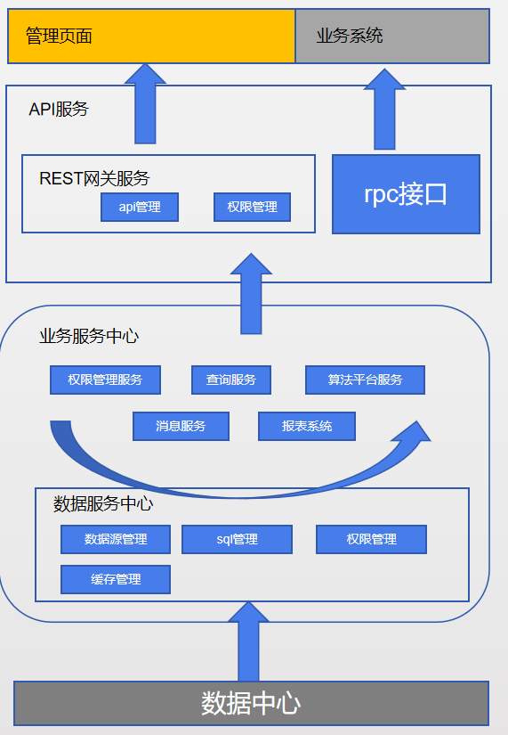

# DataCenter

### Todo:
1. CDH, hbase,zk 部署和配置。代码发布。
2. presto , redis集群，cachecloud 部署。
3. Hive 开发的流程。 azkaban安装部署。
4. Doubble 服务安装部署。 
5. MySQL的在模块里的配置。


### ：
1. 3月底代码整体提交，做一次部署测试发现问题。 3月底验证可部署性。
2. 4月份提供可以使用的一个版本。              4月底验证可使用性。
3. 5，6月份主要是做一些二次开发，使得像一个真正的产品。   6月底验证产品完整性。

*****
### 项目说明
项目整体架构  
数据服务中心管理了所有业务服务的数据访问，业务层对外提供的是dubbo接口或Rest风格接口，路由网关负责对外接口的管理，是的web应用或其他三方应用的访问具有可控性


#### big-cbr(报表系统)
数据报表系统，报表元数据存储在数据库，可以通过前端进行动态配置报表的样式和数据查询功能
#### big-dbms(数据库管理系统)
可以理解它为’一个超级大的数据访问层’，在整个项目中承担了所有数据访问的工作，
#### big-dbms-server（数据查询服务系统）
提供数据的查询功能，可集成数据源有：mysql，hive，presto
#### big-gateway（服务网关）
所有对外服务接口api（dubbo，http）管理中心，可配置api的超时，权限，重试次数
#### big-msg（消息推送 提醒）
公司内部模块（考虑删除）
#### big-whtc（数仓配置服务）
提供数仓的基本任务配置功能，提供datax的配置
#### bigdata-interface（模块的对外服务接口）
所有模块间的调用接口信息
#### bigdata-parent（父工程）
包含了所有基础框架 [详情](bigdata-parent/README.md)
### 部署顺序
#### 一、部署安装前置依赖服务
##### 1、安装部署zookeeper
网上资料较多，不在赘述
##### 2、安装部署nacos

    1). 下载地址：https://github.com/alibaba/nacos/releases  
    2). 解压 nacos-server-1.0.0-RC1.tar.gz
        目录结构：   
        |---nacos  
        |------|---bin  
        |------|---conf  
        |------|---data  
        |------|---plugins  
        |------|---target  
    3). 创建数据库：nacos-config，在将nacos/conf/nacos-mysql.sql sql中的表数据刷入nacos-config中
    4). 修改nacos/conf/application.properties
        在文件末尾添加以下类容
        
        db.num=1
        db.url.0=jdbc:mysql://188.188.22.165:3306/nacos_config?characterEncoding=utf8&connectTimeout=1000&socketTimeout=3000&autoReconnect=true
        db.user=root
        db.password=123
    
    注意：将数据库连接改一下
    5). 启动nacos
    进入nacos/bin目录，执行startup.sh 或startup.cmd
    6). 打开web页面
        地址： 127.0.0.1:8848/nacos   
        用户名：nacos  密码： nacos
        
##### 3、安装部署sentinel
>主要是安装一个控制台，实时接受服务传来的运行参数，以及实时更改或配置一些限流策略

    1)、下载
    https://github.com/alibaba/Sentinel/releases  
    选择sentinel-dashboard-1.5.0.jar 下载
    2)、安装部署
    执行以下命令即可  
    java -jar sentinel-dashboard-1.5.0.jar
    3)、访问web页面 
    默认端口是8080： 127.0.0.1:8080
##### 4、安装部署cachecloud
[部署文档](./cachecloud/README.md)
#### 二、部署bigdata-parent
因为此项目是其他项目的依赖，所以需要最先部署
```bash
cd path/to/bigdata-parent
mvn clean install
```
#### 三、部署数据服务中心项目


