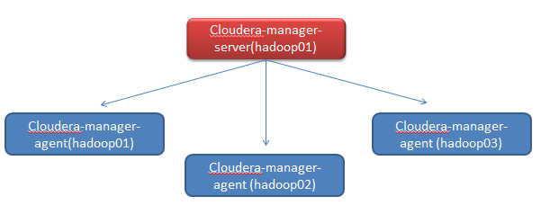

# CDH-5.13.1_centos7_install



## 一、环境
* 系统:centos7
* 配置:8核/16G内存/100G硬盘 及以上
* 机器数量:3台或以上
* jdk:1.7及以上
* python:2.7
* mysql:任意版本

## 二、所需安装包
1. CM包:
http://archive.cloudera.com/cm5/cm/5/cloudera-manager-centos7-cm5.13.1_x86_64.tar.gz
2. PARCEL包：
http://archive.cloudera.com/cdh5/parcels/5.13.1/CDH-5.13.1-1.cdh5.13.1.p0.2-el7.parcel
http://archive.cloudera.com/cdh5/parcels/5.13.1/CDH-5.13.1-1.cdh5.13.1.p0.2-el7.parcel.sha1
http://archive.cloudera.com/cdh5/parcels/5.13.1/manifest.json
3. java-mysql连接jar包：
http://central.maven.org/maven2/mysql/mysql-connector-java/5.1.22/mysql-connector-java-5.1.22.jar

## 三、机器环境配置
1. 主机名
	* 3台机器，修改/etc/sysconfig/network，设置主机名(hadoop01,hadoop02,hadoop03)
	* hostname hadoop01 // hostname hadoop02 // hostname hadoop03
2. hosts配置
	* 3台机器修改hosts：
		```
		* 192.168.*.* hadoop01
		* 192.168.*.* hadoop02
		* 192.168.*.* hadoop03
		```
3. ssh免密登录
	* 3台机器配置ssh免密登录
		```
		* ssh-keygen
		* ssh-copy-id hadoop01
		* ssh-copy-id hadoop02
		* ssh-copy-id hadoop03
		```
4. jdk环境确认
	* echo $JAVA_HOME 备用
	* java --version 确定jdk环境正常
5. 安装ntp
	```
	* yum install ntp -y
	* systemctl start ntpd.service　　#启动服务
	* systemctl enable ntpd.service　　#设置为开机启动
	```
6. 关闭防火墙
	```
	* systemctl stop firewalld.service #停止firewall
	* systemctl disable firewalld.service #禁止firewall开机启动
	```
7. yum安装
	```
	* yum install -y chkconfig python bind-utils psmisc libxslt zlib sqlite cyrus-sasl-plain cyrus-sasl-gssapi fuse fuse-libs redhat-lsb bzip2
	```
8. 配置
	* (1) echo never > /sys/kernel/mm/transparent_hugepage/defrag
	* (2) echo never > /sys/kernel/mm/transparent_hugepage/enabled
	* vim /etc/rc.local #将(1),(2)两句添加进去
	
	* sysctl vm.swappiness=10
	* vim /etc/sysctl.conf 添加vm.swappiness=10
	
	* setenforce 0
	* vim /etc/selinux/config  #将SELINUX=enforcing改为SELINUX=disabled：永久关闭

## 四、安装cloudera-manager
1. mysql驱动放置
	* 三台机器：添加 mysql-connector-java-5.1.22.jar 到 /usr/share/java
	* 三台机器：jar包名称修改为mysql-connector-java.jar
2. 将cloudera-manager包添加到三台机器
	* mkdir /opt/cloudera-manager
	* tar -zxvf cloudera-manager-centos7-cm5.13.1_x86_64.tar.gz -C /opt/cloudera-manager
3. 创建用户cloudera-scm
	* 三台机器：useradd --system --no-create-home --shell=/bin/false --comment "Cloudera SCM User" cloudera-scm
4. 配置CM Agent
	* 三台机器: 修改文件/opt/cloudera-manager/cm-5.13.1/etc/cloudera-scm-agent/config.ini 中 server_host为主节点(server节点)的主机名（如hadoop01）。
5. 配置CM Server数据库(只在server节点)
	```
	mysql -u root -p
	use mysql;
	grant all on *.* to 'temp'@'hadoop01' identified by 'temp' with grant option;
		
	cd /opt/cloudera-manager/cm-5.13.1/share/cmf/schema/
	./scm_prepare_database.sh mysql temp -h hadoop01 -utemp -ptemp --scm-host hadoop01 temp temp
	```
6. 创建Parcel目录
	```
	Server节点
		�C mkdir -p /opt/cloudera/parcel-repo
		�C chown cloudera-scm:cloudera-scm /opt/cloudera/parcel-repo
	Agent节点
		�C mkdir -p /opt/cloudera/parcels
		�C chown cloudera-scm:cloudera-scm /opt/cloudera/parcels
	```
7. 制作CDH本地源(只在server节点)
	```
	cp CDH-5.13.1-1.cdh5.13.1.p0.2-el7.parcel  /opt/cloudera/parcel-repo
	cp CDH-5.13.1-1.cdh5.13.1.p0.2-el7.parcel.sha1 /opt/cloudera/parcel-repo/CDH-5.13.1-1.cdh5.13.1.p0.2-el7.parcel.sha
	cp manifest.json /opt/cloudera/parcel-repo
	```
8. 启动cloudera-manager
	```
	cd /opt/cloudera-manager/cm-5.13.1/etc/init.d/
	hadoop01:执行./cloudera-scm-server start
	hadoop01,02,03执行：./cloudera-scm-agent start
	```
	